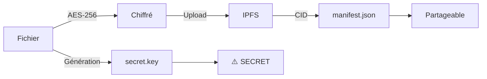

# 🔐 SISS (Secure IPFS Split-Key Storage)

**Stockage décentralisé sécurisé par séparation de clés.**

SISS permet d'uploader des fichiers chiffrés sur IPFS tout en gardant le contrôle total de l'accès via une clé secrète locale.

## ⚡ Installation

```bash
# Installe IPFS automatiquement (sans sudo, sans API key)
./install-ipfs.sh
```

Le script installe IPFS dans `~/.local/bin/` et démarre automatiquement le daemon.

## 🚀 Utilisation

### 📤 Upload

```bash
./siss-ipfs.sh upload <fichier> <nom-du-projet>
```

Exemple :
```bash
./siss-ipfs.sh upload ./contrat.pdf audit-2025
```

**Résultat** : Crée `uploads/audit-2025/` avec `manifest.json` (public) et `secret.key` (privé).

### 📥 Read

```bash
./siss-ipfs.sh read <nom-du-projet>
```

Récupère le fichier depuis IPFS, vérifie la signature, déchiffre et enregistre dans `outputs/`.

### 📋 List

```bash
./siss-ipfs.sh list
```

---

## 🏗 Architecture

**Séparation stricte (Split-Key)** :

- **Sur IPFS** : Fichier chiffré (AES-256) + Métadonnées publiques
- **En Local** : Clé de déchiffrement (`secret.key`)



## 📂 Structure

```
SISS/
├── siss-ipfs.sh         # Script principal
├── install-ipfs.sh     # Installation auto
├── uploads/            # Clés et manifests
│   └── projet-x/
│       ├── manifest.json  # Public
│       └── secret.key     # Privé
└── outputs/            # Fichiers déchiffrés
```

## 🔧 Prérequis

- Linux / macOS
- `openssl` (généralement pré-installé)
- `curl` (généralement pré-installé)

**IPFS est installé automatiquement par `./install-ipfs.sh`.**

---

**Aucune API key requise. Fonctionne entièrement en local avec IPFS CLI.**
